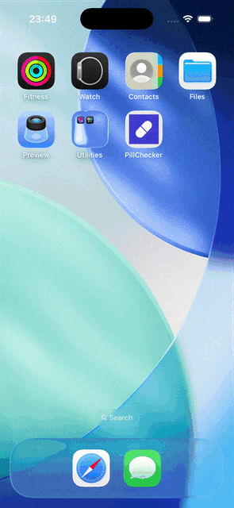

# PillChecker iOS

A native iOS app that checks drug-drug interactions by scanning or searching for two medications.



**Backend API:** [pillchecker-api](https://github.com/SPerekrestova/pillchecker-api)

## Requirements

- Xcode 16+
- iOS 17+
- A running instance of the [backend API](https://github.com/SPerekrestova/pillchecker-api)

## Setup

```bash
git clone https://github.com/SPerekrestova/pillchecker-app.git
cd pillchecker-app
open PillChecker.xcodeproj
```

Set `API_BASE_URL` in Xcode → Product → Scheme → Edit Scheme → Environment Variables (or override the build setting in `project.pbxproj`). Default is `http://localhost:8000`.

Run on simulator or device with **Cmd+R**.

## Architecture

| Layer | Technology |
|-------|-----------|
| Persistence | SwiftData (`CheckRecord`) |
| OCR | Apple Vision (`VNRecognizeTextRequest`) |
| Drug search | RxNorm REST API |
| Interaction check | Custom backend API |

## Data Sources

- **RxNorm REST API** — drug name normalization and autocomplete (National Library of Medicine)
- **OpenFDA** — drug interaction data via the backend API (US Public Domain)
- **OpenMed NER PharmaDetect** — drug entity recognition model used by the backend

## Medical Disclaimer

> **⚠️ MEDICAL DISCLAIMER**
>
> This app is provided for **informational and self-educational purposes only**. The information provided should **not** be treated as medical advice, diagnosis, or treatment.
>
> **Always consult with a qualified healthcare professional** before making any decisions regarding your medications. The developer assumes **no responsibility** for any consequences arising from use of this app.
